# CloudCart — Production-Ready 3-Tier Kubernetes DevOps Platform


CloudCart is a production-style 3-tier DevOps platform built with React, Flask, PostgreSQL, Docker, Kubernetes, Terraform, Amazon ECR, Amazon EKS, GitHub Actions, AWS OIDC, and Trivy.

The project demonstrates the complete lifecycle of a cloud-native application: containerization, local orchestration with Docker Compose, Kubernetes deployment, ingress routing, health and readiness checks, metrics exposure, CPU-based autoscaling, Terraform-based AWS infrastructure provisioning, S3 remote state management, ECR image publishing, secure CI/CD with GitHub Actions OIDC, container image vulnerability scanning, and optional deployment to Amazon EKS.

---

## Table of Contents

* [Project Highlights](#project-highlights)
* [Architecture](#architecture)
* [Tech Stack](#tech-stack)
* [Screenshots](#screenshots)
* [Application Features](#application-features)
* [API Endpoints](#api-endpoints)
* [Local Docker Setup](#local-docker-setup)
* [Local Kubernetes Deployment](#local-kubernetes-deployment)
* [NGINX Ingress Setup](#nginx-ingress-setup)
* [Horizontal Pod Autoscaling](#horizontal-pod-autoscaling)
* [AWS EKS Deployment](#aws-eks-deployment)
* [Terraform Infrastructure](#terraform-infrastructure)
* [CI/CD Pipeline](#cicd-pipeline)
* [Project Structure](#project-structure)
* [What This Project Demonstrates](#what-this-project-demonstrates)
* [Production Roadmap](#production-roadmap)
* [Security Notes](#security-notes)
* [Cost Control](#cost-control)
* [CV Summary](#cv-summary)

---

## Project Highlights

* Built a full 3-tier application: frontend, backend, and database.
* Containerized all services using Docker.
* Created a local full-stack environment using Docker Compose.
* Deployed the platform locally on Kubernetes using Deployments and Services.
* Used ConfigMaps and Secrets for environment-based configuration.
* Added PostgreSQL storage using a PersistentVolumeClaim in the local Kubernetes setup.
* Exposed the local Kubernetes application using NGINX Ingress and a local domain.
* Implemented liveness and readiness probes.
* Added Prometheus-compatible backend metrics.
* Installed Metrics Server for resource metrics.
* Configured Horizontal Pod Autoscaling for the backend.
* Performed load testing that scaled backend replicas from 2 to 6.
* Provisioned AWS infrastructure using Terraform.
* Configured Terraform remote state using an encrypted S3 backend with S3 native locking.
* Created Amazon ECR repositories for backend and frontend container images.
* Tagged and pushed Docker images to Amazon ECR.
* Deployed CloudCart successfully to Amazon EKS.
* Exposed the EKS deployment externally using an AWS LoadBalancer service.
* Verified HPA autoscaling on EKS with backend replicas scaling from 2 to 6.
* Built a GitHub Actions CI pipeline using AWS OIDC without long-lived access keys.
* Automated Docker image build and push to Amazon ECR.
* Added Terraform formatting and validation checks in CI.
* Added Trivy vulnerability scanning for backend and frontend container images.
* Added optional manual CD deployment to EKS using GitHub Actions workflow dispatch.
* Added proof screenshots for local Kubernetes, AWS EKS, HPA, ECR publishing, and CI security scanning.

---

## Architecture

### Local Kubernetes Architecture

```text
User Browser
    |
    | http://cloudcart.local
    v
NGINX Ingress Controller
    |
    |-- /              --> cloudcart-frontend Service --> React + NGINX Pods
    |
    |-- /api/*         --> cloudcart-backend Service  --> Flask API Pods
                                                        |
                                                        v
                                                PostgreSQL Service
                                                        |
                                                        v
                                                PostgreSQL Pod + PVC
```

### AWS EKS Architecture

```text
User Browser
    |
    | HTTP
    v
AWS LoadBalancer
    |
    v
cloudcart-frontend Service
    |
    v
React + NGINX Pods
    |
    | /api/*
    v
cloudcart-backend Service
    |
    v
Flask API Pods
    |
    v
cloudcart-postgres Service
    |
    v
PostgreSQL Pod
```

### AWS Infrastructure Overview

```text
Terraform
    |
    v
AWS VPC
    |
    |-- Public Subnet - AZ 1
    |       |
    |       v
    |   EKS Worker Node
    |
    |-- Public Subnet - AZ 2
            |
            v
        EKS Worker Node

Amazon ECR
    |
    |-- cloudcart-backend:latest
    |-- cloudcart-backend:<commit-sha>
    |-- cloudcart-frontend:latest
    |-- cloudcart-frontend:<commit-sha>

Amazon EKS
    |
    |-- Namespace
    |-- Deployments
    |-- Services
    |-- ConfigMap
    |-- Secret
    |-- HPA
    |-- Metrics Server

GitHub Actions
    |
    |-- OIDC authentication to AWS
    |-- Terraform validation
    |-- Docker build
    |-- Trivy image scanning
    |-- ECR push
    |-- Optional EKS deployment
```

---

## Tech Stack

| Layer                  | Technology                                                             |
| ---------------------- | ---------------------------------------------------------------------- |
| Frontend               | React, Vite, NGINX                                                     |
| Backend                | Python, Flask, SQLAlchemy, Gunicorn                                    |
| Database               | PostgreSQL                                                             |
| Containerization       | Docker, Docker Compose                                                 |
| Container Registry     | Amazon ECR                                                             |
| Orchestration          | Kubernetes, Amazon EKS                                                 |
| Infrastructure as Code | Terraform                                                              |
| Terraform State        | Amazon S3 remote backend with native state locking                     |
| CI/CD                  | GitHub Actions, Terraform validation, Trivy image scanning             |
| Cloud Authentication   | GitHub Actions OIDC, AWS IAM Role                                      |
| Security Scanning      | Trivy                                                                  |
| Routing                | NGINX Ingress Controller, AWS LoadBalancer                             |
| Configuration          | ConfigMap, Secret                                                      |
| Storage                | PersistentVolumeClaim for local Kubernetes, emptyDir for EKS demo mode |
| Observability          | Health checks, readiness checks, Prometheus-compatible metrics         |
| Autoscaling            | Metrics Server, Horizontal Pod Autoscaler                              |
| Local Cluster          | Docker Desktop Kubernetes                                              |
| Cloud Platform         | AWS                                                                    |

---

## Screenshots

### Local Kubernetes Deployment

#### CloudCart Dashboard

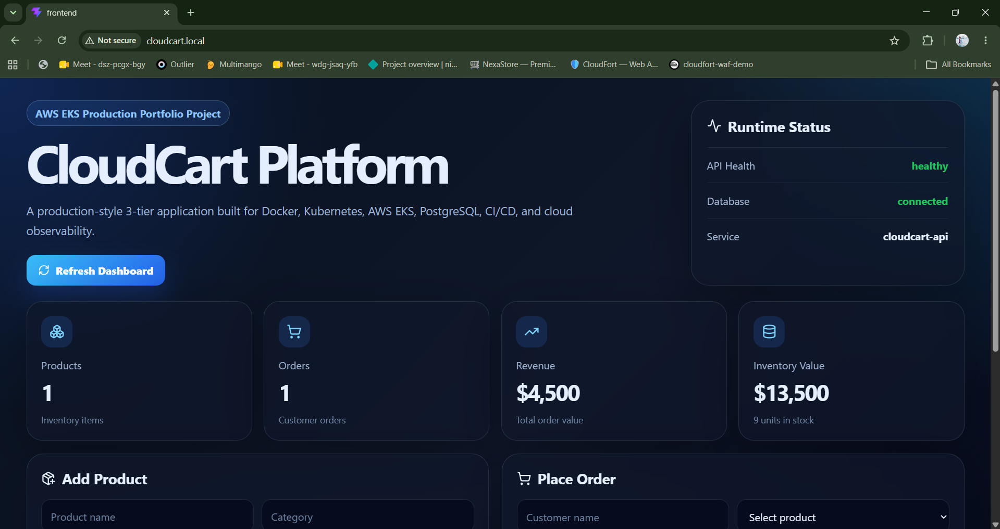

#### Kubernetes Pods Running

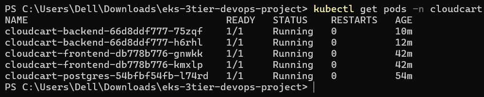

#### Kubernetes Services

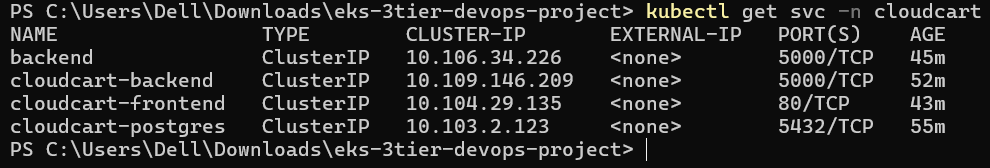

#### NGINX Ingress

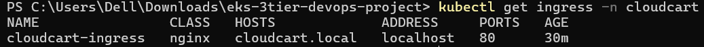

#### HPA Scaling: Backend Replicas Scaled from 2 to 6

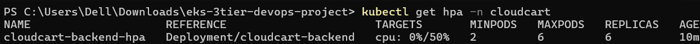

#### Pod Resource Usage During Load Test

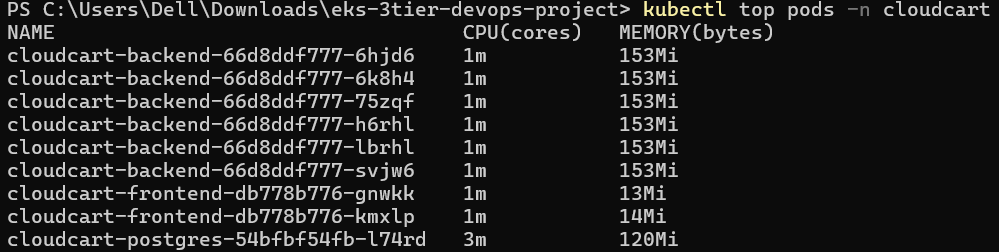

#### API Health and Readiness Checks

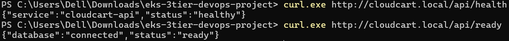

---

### AWS EKS Deployment

#### EKS Worker Nodes Ready

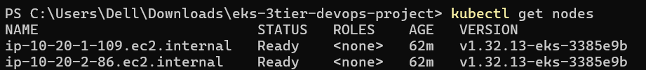

#### CloudCart Pods Running on EKS

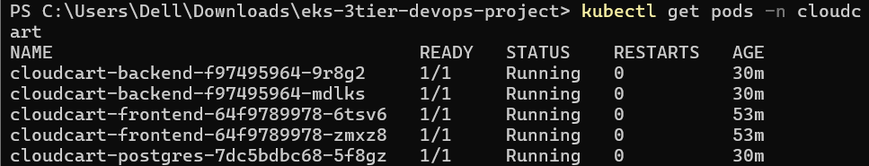

#### AWS LoadBalancer Service

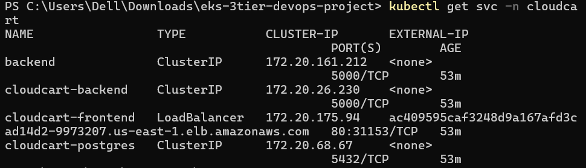

#### API Health and Readiness from AWS LoadBalancer

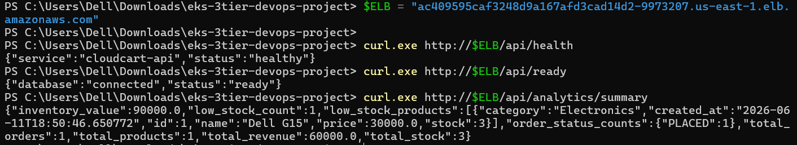

#### HPA Autoscaling on EKS

The backend deployment was scaled by Kubernetes HPA from 2 replicas to 6 replicas under load.

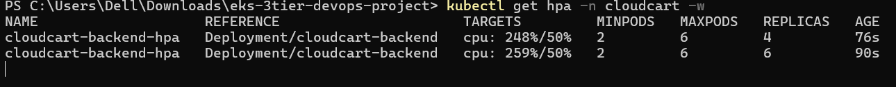

#### Pod Metrics on EKS

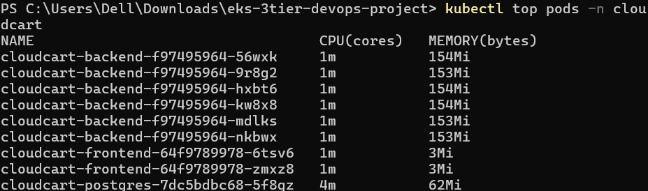

---

### GitHub Actions CI/CD

#### GitHub Actions ECR Pipeline Success

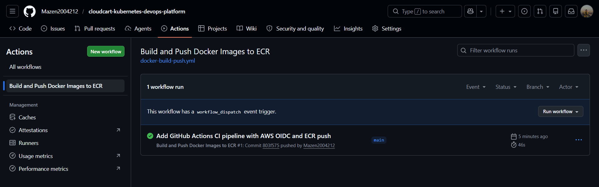

#### GitHub Actions CI/CD Workflow Runs

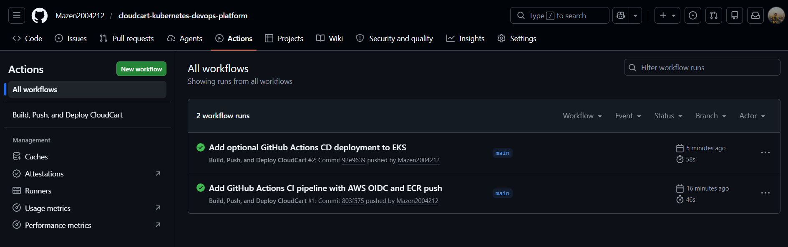

#### GitHub Actions Security Scan and Terraform Validation

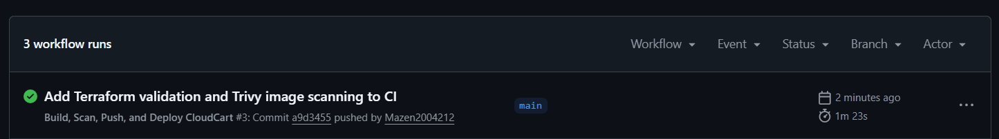

---

## Application Features

CloudCart provides a dashboard for managing products and orders.

| Feature             | Description                                                 |
| ------------------- | ----------------------------------------------------------- |
| Product management  | Add and list products                                       |
| Order management    | Place and list customer orders                              |
| Inventory tracking  | Product stock updates after order creation                  |
| Analytics dashboard | Total products, orders, revenue, stock, and inventory value |
| Health endpoint     | Confirms API availability                                   |
| Readiness endpoint  | Confirms database connectivity                              |
| Metrics endpoint    | Exposes Prometheus-compatible HTTP metrics                  |
| Stress endpoint     | Generates CPU load for autoscaling tests                    |

---

## API Endpoints

| Endpoint                 | Method | Description                         |
| ------------------------ | ------ | ----------------------------------- |
| `/api/health`            | GET    | API health check                    |
| `/api/ready`             | GET    | Database readiness check            |
| `/api/products`          | GET    | List products                       |
| `/api/products`          | POST   | Create product                      |
| `/api/orders`            | GET    | List orders                         |
| `/api/orders`            | POST   | Create order                        |
| `/api/analytics/summary` | GET    | Dashboard analytics summary         |
| `/api/metrics`           | GET    | Prometheus-compatible metrics       |
| `/api/stress`            | GET    | CPU stress endpoint for HPA testing |

---

## Local Docker Setup

### 1. Start the full stack

```bash
docker compose up --build
```

### 2. Open the application

```text
http://localhost:3000
```

### 3. Test the API through the frontend NGINX proxy

```bash
curl http://localhost:3000/api/health
curl http://localhost:3000/api/ready
```

---

## Local Kubernetes Deployment

This project was deployed and tested locally using Docker Desktop Kubernetes.

### 1. Verify Kubernetes

```bash
kubectl get nodes
```

Expected output:

```text
docker-desktop   Ready
```

### 2. Build local images

```bash
docker build -t cloudcart-backend:local ./backend
docker build -t cloudcart-frontend:local --build-arg VITE_API_BASE_URL=/api ./frontend
```

### 3. Apply Kubernetes manifests

```bash
kubectl apply -f k8s/00-namespace.yaml
kubectl apply -f k8s/01-configmap.yaml
kubectl apply -f k8s/02-secret.yaml
kubectl apply -f k8s/03-postgres.yaml
kubectl apply -f k8s/04-backend.yaml
kubectl apply -f k8s/04b-backend-alias.yaml
kubectl apply -f k8s/05-frontend.yaml
```

### 4. Verify workloads

```bash
kubectl get pods -n cloudcart
kubectl get svc -n cloudcart
```

---

## NGINX Ingress Setup

### 1. Install NGINX Ingress Controller

```bash
kubectl apply -f https://raw.githubusercontent.com/kubernetes/ingress-nginx/controller-v1.15.1/deploy/static/provider/cloud/deploy.yaml
```

### 2. Wait for the controller to become ready

```bash
kubectl wait --namespace ingress-nginx \
  --for=condition=ready pod \
  --selector=app.kubernetes.io/component=controller \
  --timeout=120s
```

### 3. Add local domain to hosts file

On Windows, open this file as Administrator:

```text
C:\Windows\System32\drivers\etc\hosts
```

Add:

```text
127.0.0.1 cloudcart.local
```

### 4. Apply Ingress

```bash
kubectl apply -f k8s/06-ingress.yaml
```

### 5. Open the application

```text
http://cloudcart.local
```

### 6. Test API through Ingress

```bash
curl http://cloudcart.local/api/health
curl http://cloudcart.local/api/ready
```

---

## Horizontal Pod Autoscaling

CloudCart uses Kubernetes HPA to scale backend replicas based on CPU utilization.

### 1. Install Metrics Server

```bash
kubectl apply -f https://github.com/kubernetes-sigs/metrics-server/releases/latest/download/components.yaml
```

### 2. Patch Metrics Server for Docker Desktop Kubernetes

This patch is needed for Docker Desktop Kubernetes because kubelet certificate validation can block metrics collection.

```bash
kubectl patch deployment metrics-server -n kube-system --type='json' -p='[
  {
    "op": "replace",
    "path": "/spec/template/spec/containers/0/args",
    "value": [
      "--cert-dir=/tmp",
      "--secure-port=10250",
      "--kubelet-preferred-address-types=InternalIP,ExternalIP,Hostname",
      "--kubelet-use-node-status-port",
      "--metric-resolution=15s",
      "--kubelet-insecure-tls"
    ]
  }
]'
```

### 3. Verify Metrics Server

```bash
kubectl top nodes
kubectl top pods -n cloudcart
```

### 4. Apply HPA

```bash
kubectl apply -f k8s/07-hpa.yaml
```

### 5. Verify HPA

```bash
kubectl get hpa -n cloudcart
```

Configuration:

| Setting           | Value               |
| ----------------- | ------------------- |
| Target deployment | `cloudcart-backend` |
| Minimum replicas  | 2                   |
| Maximum replicas  | 6                   |
| CPU target        | 50%                 |

During load testing, the backend scaled from 2 replicas to 6 replicas.

---

## HPA Load Test Demo

### 1. Start load generator

```bash
kubectl run load-generator -n cloudcart \
  --image=busybox:1.36 \
  --restart=Never \
  -- /bin/sh -c "while true; do wget -q -O- http://cloudcart-backend:5000/api/stress > /dev/null; done"
```

### 2. Watch autoscaling

```bash
kubectl get hpa -n cloudcart -w
```

### 3. Watch backend pods

```bash
kubectl get pods -n cloudcart -w
```

### 4. Stop load generator

```bash
kubectl delete pod load-generator -n cloudcart
```

---

## Kubernetes Resources

| Resource                | Purpose                                                              |
| ----------------------- | -------------------------------------------------------------------- |
| Namespace               | Isolates CloudCart resources                                         |
| ConfigMap               | Stores non-sensitive application configuration                       |
| Secret                  | Stores database username and password                                |
| PersistentVolumeClaim   | Provides persistent PostgreSQL storage in the local Kubernetes setup |
| Deployment              | Runs frontend, backend, and database pods                            |
| Service                 | Provides internal service discovery                                  |
| Ingress                 | Exposes frontend and backend API using host/path routing locally     |
| HorizontalPodAutoscaler | Scales backend pods based on CPU utilization                         |

---

## AWS EKS Deployment

CloudCart was deployed successfully on Amazon EKS using Terraform-managed infrastructure and Docker images stored in Amazon ECR.

### AWS Infrastructure Provisioned with Terraform

The AWS environment includes:

* Custom VPC
* Public subnets across two Availability Zones
* Internet Gateway
* Route tables
* IAM roles for the EKS control plane and worker nodes
* Amazon EKS cluster
* EKS managed node group
* Amazon ECR repositories for frontend and backend images
* EKS access entry for the GitHub Actions deployment role

### ECR Images

The application images are built, tagged, and pushed to Amazon ECR.

Images pushed by the CI pipeline include:

* `cloudcart-backend:latest`
* `cloudcart-backend:<commit-sha>`
* `cloudcart-frontend:latest`
* `cloudcart-frontend:<commit-sha>`

Using commit SHA tags makes every image traceable to a specific Git commit.

### EKS Kubernetes Resources

The AWS deployment uses a separate `k8s-aws/` manifest directory to avoid changing the local Kubernetes manifests.

The EKS deployment includes:

* Namespace
* ConfigMap
* Secret
* PostgreSQL Deployment and Service
* Backend Deployment and Service
* Frontend Deployment and AWS LoadBalancer Service
* Metrics Server
* Horizontal Pod Autoscaler

### Current AWS Database Mode

For the EKS demo deployment, PostgreSQL runs inside Kubernetes using temporary `emptyDir` storage to keep the deployment cost-aware and simple.

This keeps the AWS demo lightweight while still proving that the application, services, container images, networking, LoadBalancer exposure, health checks, and autoscaling work correctly on EKS.

For a production-grade AWS deployment, the database layer can be upgraded to:

* Amazon RDS PostgreSQL
* EBS-backed PersistentVolume using the AWS EBS CSI Driver

---

## Terraform Infrastructure

Terraform is used to provision the AWS infrastructure required for the EKS deployment.

### Terraform Components

| File           | Purpose                                                                    |
| -------------- | -------------------------------------------------------------------------- |
| `backend.tf`   | Configures the S3 remote backend and native state locking                  |
| `versions.tf`  | Defines Terraform and provider versions                                    |
| `provider.tf`  | Configures the AWS provider                                                |
| `variables.tf` | Stores reusable input variables                                            |
| `vpc.tf`       | Creates VPC, public subnets, internet gateway, and route tables            |
| `iam.tf`       | Creates IAM roles and policy attachments for EKS                           |
| `eks.tf`       | Creates the EKS cluster, managed node group, and GitHub Actions EKS access |
| `outputs.tf`   | Exposes useful infrastructure outputs                                      |

### Terraform Workflow

```bash
cd terraform
terraform init
terraform validate
terraform plan -out=tfplan
terraform apply tfplan
```

### Remote Terraform State

Terraform is configured to use an Amazon S3 remote backend for centralized state management.

The backend includes:

* S3 bucket for Terraform state storage
* State encryption enabled
* S3 bucket versioning enabled
* S3 native state locking using `use_lockfile = true`
* Public access blocked on the state bucket

This makes the infrastructure workflow closer to production standards and avoids relying on local-only Terraform state files.

### Configure kubectl for EKS

```bash
aws eks update-kubeconfig --region us-east-1 --name cloudcart-eks
kubectl get nodes
```

### Deploy CloudCart to EKS Manually

```bash
kubectl apply -f k8s-aws/00-namespace.yaml
kubectl apply -f k8s-aws/01-configmap.yaml
kubectl apply -f k8s-aws/02-secret.yaml
kubectl apply -f k8s-aws/03-postgres.yaml
kubectl apply -f k8s-aws/04-backend.yaml
kubectl apply -f k8s-aws/04b-backend-alias.yaml
kubectl apply -f k8s-aws/05-frontend.yaml
kubectl apply -f k8s-aws/07-hpa.yaml
```

### Verify EKS Deployment

```bash
kubectl get nodes
kubectl get pods -n cloudcart
kubectl get svc -n cloudcart
kubectl get hpa -n cloudcart
kubectl top pods -n cloudcart
```

### Access the Application on AWS

Get the AWS LoadBalancer DNS:

```bash
kubectl get svc cloudcart-frontend -n cloudcart
```

Open the LoadBalancer DNS in the browser:

```text
http://<aws-loadbalancer-dns>
```

Test the API:

```bash
curl http://<aws-loadbalancer-dns>/api/health
curl http://<aws-loadbalancer-dns>/api/ready
curl http://<aws-loadbalancer-dns>/api/analytics/summary
```

---

## CI/CD Pipeline

CloudCart includes a GitHub Actions CI/CD pipeline integrated with AWS using OpenID Connect.

The pipeline validates Terraform configuration, builds Docker images, scans container images with Trivy, authenticates to AWS securely without long-lived access keys, pushes images to Amazon ECR, and supports optional deployment to Amazon EKS.

### CI Pipeline

On every push to the `main` branch affecting the backend, frontend, Terraform files, Kubernetes AWS manifests, Docker Compose file, or workflow configuration, GitHub Actions performs the following steps:

* Checks out the repository.
* Runs Terraform formatting validation.
* Initializes Terraform without backend for CI validation.
* Validates the Terraform configuration.
* Authenticates to AWS using GitHub Actions OIDC.
* Assumes a dedicated IAM role in AWS.
* Logs in to Amazon ECR.
* Builds the backend Docker image.
* Builds the frontend Docker image.
* Scans backend and frontend images with Trivy.
* Tags both images with `latest`.
* Tags both images with the Git commit SHA.
* Pushes both images to Amazon ECR.

### CI Quality Gate

The pipeline includes a quality gate before publishing images to Amazon ECR.

The quality gate performs:

* Terraform formatting validation.
* Terraform initialization without backend for CI validation.
* Terraform configuration validation.
* Backend Docker image build.
* Frontend Docker image build.
* Trivy vulnerability scanning for backend and frontend images.
* Image publishing to Amazon ECR only after successful build and scan stages.

### CD Pipeline

The workflow also includes an optional manual deployment job using `workflow_dispatch`.

When triggered manually with `deploy_to_eks=true`, the pipeline:

* Updates kubeconfig for the EKS cluster.
* Applies the Kubernetes manifests from `k8s-aws/`.
* Updates backend and frontend deployments to use the Git commit SHA image tag.
* Waits for Kubernetes rollout completion.
* Displays pods, services, and HPA status.

The deployment step is intentionally manual because the EKS cluster is created only during demos to control AWS costs.

### AWS Authentication

The pipeline uses GitHub Actions OIDC authentication instead of long-lived AWS access keys.

This improves security by allowing GitHub Actions to assume a dedicated IAM role with temporary credentials.

### ECR Image Tags

Each successful pipeline run pushes two tags for each image:

* `latest`
* Git commit SHA

This makes each deployment traceable to a specific source code version.

### GitHub Actions Proof


---

## Project Structure

```text
cloudcart-kubernetes-devops-platform/
│
├── .github/
│   └── workflows/
│       └── docker-build-push.yml
│
├── backend/
│   ├── app/
│   ├── Dockerfile
│   ├── requirements.txt
│   └── wsgi.py
│
├── frontend/
│   ├── src/
│   ├── Dockerfile
│   ├── nginx.conf
│   └── package.json
│
├── k8s/
│   ├── 00-namespace.yaml
│   ├── 01-configmap.yaml
│   ├── 02-secret.yaml
│   ├── 03-postgres.yaml
│   ├── 04-backend.yaml
│   ├── 04b-backend-alias.yaml
│   ├── 05-frontend.yaml
│   ├── 06-ingress.yaml
│   └── 07-hpa.yaml
│
├── k8s-aws/
│   ├── 00-namespace.yaml
│   ├── 01-configmap.yaml
│   ├── 02-secret.yaml
│   ├── 03-postgres.yaml
│   ├── 04-backend.yaml
│   ├── 04b-backend-alias.yaml
│   ├── 05-frontend.yaml
│   ├── 06-ingress.yaml
│   └── 07-hpa.yaml
│
├── terraform/
│   ├── backend.tf
│   ├── versions.tf
│   ├── provider.tf
│   ├── variables.tf
│   ├── vpc.tf
│   ├── iam.tf
│   ├── eks.tf
│   ├── outputs.tf
│   ├── .terraform.lock.hcl
│   └── .gitignore
│
├── screenshots/
│   ├── api-health-ready-checks.png
│   ├── dashboard-cloudcart-local.png
│   ├── eks-api-health-ready.png
│   ├── eks-cloudcart-pods-running.png
│   ├── eks-hpa-scaled-to-6.png
│   ├── eks-loadbalancer-service.png
│   ├── eks-nodes-ready.png
│   ├── eks-top-pods.png
│   ├── github-actions-cicd-success.png
│   ├── github-actions-ecr-success.png
│   ├── github-actions-security-scan-success.png
│   ├── hpa-scaled-to-6-replicas.png
│   ├── ingress-cloudcart-local.png
│   ├── kubernetes-pods-running.png
│   ├── kubernetes-services.png
│   └── top-pods-load-test.png
│
├── docker-compose.yaml
├── README.md
└── .gitignore
```

---

## What This Project Demonstrates

This project demonstrates hands-on DevOps, Kubernetes, AWS, and CI/CD skills, including:

* Containerizing multi-service applications.
* Running full-stack applications locally using Docker Compose.
* Designing Kubernetes manifests for frontend, backend, and database workloads.
* Managing application configuration with ConfigMaps and Secrets.
* Persisting database data with PVCs in local Kubernetes.
* Using temporary storage for a cost-aware EKS demo deployment.
* Exposing applications through NGINX Ingress locally.
* Exposing applications through an AWS LoadBalancer on EKS.
* Implementing health and readiness checks.
* Exposing application-level metrics.
* Using Metrics Server and HPA for autoscaling.
* Performing load testing to validate scaling behavior.
* Creating AWS infrastructure using Terraform.
* Managing Terraform state remotely with Amazon S3.
* Validating Terraform configuration in CI before deployment.
* Creating and using Amazon ECR repositories.
* Deploying containerized workloads to Amazon EKS.
* Authenticating GitHub Actions to AWS using OIDC.
* Building and pushing Docker images automatically using GitHub Actions.
* Scanning container images with Trivy before publishing to ECR.
* Adding a CI quality gate before image release.
* Supporting optional manual CD deployment to Amazon EKS.
* Verifying Kubernetes workloads, services, metrics, and autoscaling in the cloud.

---

## Production Roadmap

The current EKS deployment proves that CloudCart can run successfully on AWS using Terraform-managed infrastructure, ECR-hosted images, Kubernetes workloads, AWS LoadBalancer exposure, GitHub Actions CI/CD, Trivy security scanning, and HPA autoscaling.

Future production improvements include:

* Replace in-cluster PostgreSQL with Amazon RDS PostgreSQL.
* Add AWS EBS CSI Driver for persistent Kubernetes storage.
* Deploy AWS Load Balancer Controller for ALB-based ingress.
* Add Route53 DNS and ACM-managed TLS certificates.
* Add Argo CD for GitOps-based Kubernetes delivery.
* Add centralized monitoring with Prometheus and Grafana.
* Add log aggregation using CloudWatch, ELK, Loki, or OpenSearch.
* Add network hardening using private subnets and least-privilege security groups.
* Add SBOM generation, image signing, and policy enforcement for container supply-chain security.

---

## Security Notes

* Kubernetes Secrets are used for database credentials.
* No AWS access keys or secret keys should be committed to the repository.
* GitHub Actions authenticates to AWS using OIDC instead of long-lived access keys.
* The CI/CD pipeline assumes a dedicated IAM role with scoped permissions.
* Terraform remote state is configured with an encrypted S3 backend, bucket versioning, public access blocking, and S3 native state locking using `use_lockfile = true`.
* Terraform state files, Terraform plan files, and the `.terraform/` directory should not be committed to the repository.
* Container images are scanned with Trivy during CI before being published to Amazon ECR.

---

## Cost Control

AWS resources such as EKS clusters, EC2 worker nodes, and LoadBalancers can generate ongoing charges while running.

For cost control, the EKS environment should be created only during demos and destroyed after validation.

Create infrastructure:

```bash
cd terraform
terraform init
terraform plan -out=tfplan
terraform apply tfplan
```

Destroy infrastructure after the demo:

```bash
cd terraform
terraform destroy
```

The Amazon ECR repositories and S3 Terraform backend can remain available because they are low-cost compared to EKS and EC2 worker nodes.

---

## CV Summary

CloudCart is a production-style DevOps project demonstrating Docker, Kubernetes, AWS EKS, Terraform, Amazon ECR, GitHub Actions CI/CD, GitHub OIDC, Trivy security scanning, PostgreSQL, LoadBalancer exposure, health checks, metrics, and CPU-based autoscaling.

The project proves hands-on experience with full-stack containerization, Kubernetes workloads, service discovery, configuration management, persistent and temporary storage strategies, ingress/load balancer exposure, infrastructure as code, remote Terraform state management, ECR image publishing, cloud deployment, secure CI/CD automation, container image vulnerability scanning, CI quality gates, and HPA autoscaling.
